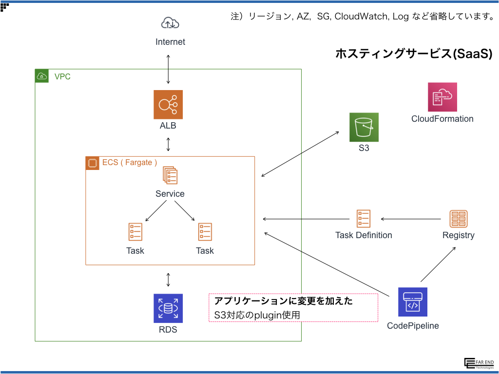
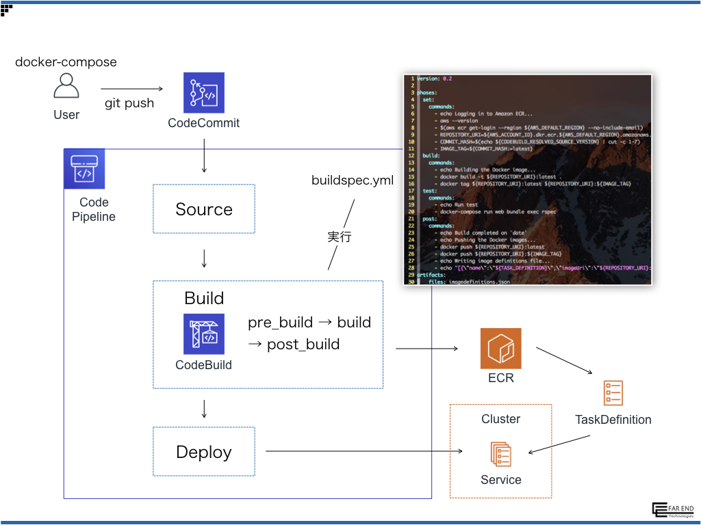

# 概要

以下の作業をハンズオンで行います。

1. Redmineをdockerイメージに固めてECSへデプロイします。
2. AWS Pipelineを利用してRedmineのデプロイを行います。

構成図は以下を確認してください。

### ECS 構成図


### Pipeline 構成図


参考  
https://www.farend.co.jp/blog/2019/02/jaws-days-2019/

# 1. IAMユーザ登録

ユーザ作成後は credentialsファイルをダウンロードしてください。（ Access key ID と Secret access key を使用します。）

## ユーザ作成 その１

注）すでに[AdministratorAccess]の権限を持ったユーザがあり、それを利用する場合は不要です。

- コンソール操作、git操作、ECRの操作
- 名前は任意でOK
- [AdministratorAccess]のロールをつけてください。
- [プログラムによるアクセス]と[AWS マネジメントコンソールへのアクセス]にチェックを入れてください。
- 以下のサイトを参考にして、CodeCommitにアクセスできるように認証をおこなってください。  
https://docs.aws.amazon.com/ja_jp/codecommit/latest/userguide/setting-up-gc.html

credentialsファイルをダウンロードして置いてください。

## ユーザ作成 その２

注）S3へのアクセスもユーザ1で行う場合は作成不要です。(オススメはしません)

- S3用のユーザを作成
- 名前は任意でOK
- [AmazonS3FullAccess]のロールをつけてください。
- [プログラムによるアクセス]にチェックを入れてください。

# 2. AWS CLI インストール

以下のサイトを参考にインストール作業とログインをおこなってください。
（事前に[AdministratorAccess]の権限を持ったユーザを準備してからおこなってください。）
https://docs.aws.amazon.com/ja_jp/streams/latest/dev/kinesis-tutorial-cli-installation.html


# 3. cloudformationの登録方法

以下のページを参考にしてスタックを作成します。
（CloudFormationを利用してvpc,s3,rdsを作成します）
https://qiita.com/yoshiokaCB/private/7e126403cb4fb1258ceb


# 4. docker-compose ローカルで動作確認

**ソースコードのダウンロード**

今回デプロイするRedmineのソースコードをダウンロードする。
（buildファイルとS3へファイルをアップロードするためのPluginも含みます。）

```
$ cd [path/to/workspace]
$ git clone -b aws/4.0-stable https://github.com/yoshiokaCB/redmine.git
```

**環境変数の設定**

docker-compose.ymlの環境変数を編集します。
S3のアップロードように作せしたユーザの ACCESS_KEY_ID, AWS_SECRET_ACCESS_KEY を書き込みます。
bucket-nameは他の人と被らないようにユニークな名称にしてください（例：[yourname-20190330]）

```
$ cd redmine
$ vi docker-compose.yml
...
AWS_ACCESS_KEY_ID: [S3_ACCESS_KEY_ID]
AWS_SECRET_ACCESS_KEY: [S3_SECRET_ACCESS_KEY]
S3_BUCKET_NAME: [bucket-name]
...

```

**動作確認**

上記設定が終わったら、イメージを起動して動作確認を行います。

```
$ docker-compose up -d
```

以下の `localhost:3000` へアクセスし、ログイン、プロジェクト作成、チケット作成を行い、チケット作成時にS3にファイルがアップロードされているか確認する。 （初期のログインID, Passwordは admin ）


# 5. ECSデプロイ

## 5-1. ECR（リポジトリ）の作成とアップロード

(1) サービスから「ECS」を選択し、左側にあるメニューから「リポジトリ」を選択します。

(2) 「リポジトリ作成」をクリックしECRのリポジトリーを作成します。（例：redmine_app）  
ローカル環境で作成されたredmineのイメージファイルと同じリポジトリ名にしておくと、「プッシュコマンドの表示」と同じ手順で登録できます。

**[プッシュコマンドの表示]のサンプル**
```
$ $(aws ecr get-login --no-include-email --region ap-northeast-1)
$ docker tag [image-name]:latest [aws-acount-id].dkr.ecr.ap-northeast-1.amazonaws.com/[ecr-image-name]:latest
$ docker push [aws-acount-id].dkr.ecr.ap-northeast-1.amazonaws.com/[ecr-image-name]:latest
```

**注）`[aws-acount-id].dkr.ecr.ap-northeast-1.amazonaws.com/[ecr-image-name]:latest` は「TaskDefinition」でコンテナを追加するときに入力しますのでメモしておいてください。**

上記手順でdocker image をプッシュしたらAWSでアップロードされていることを確認してください。


## 5-2. Application Load Balancer(ALB)の作成

以下のページを参考にしてALBを作成します。

「Application Load Balancer 作成手順」  
https://qiita.com/yoshiokaCB/private/e2c75f31e65731b89bd0

## 5-3. TaskDefinitionの作成

「タスク定義（TaskDefinition） 作成手順」  
https://qiita.com/yoshiokaCB/private/11b6e5ec559c238bacfe


## 5-4. クラスターの作成

「ECS クラスターの作成手順」  
https://qiita.com/yoshiokaCB/private/e94b735216a2855eca33

## 5-5. サービスの作成

「ECS サービスの設定手順」  
https://qiita.com/yoshiokaCB/private/230340c0045d0439f87a


# 6. Pipeline登録

## 6-1. CodeCommitの作成

## 6-2. CodeBuildの作成

「CodeBuildの設定手順」  
https://qiita.com/yoshiokaCB/private/b2b6e8927db46674f6df

## 6-1. CodePipelineの作成

「CodePipelineの設定手順」  
https://qiita.com/yoshiokaCB/private/5e6e392f5aeffb7aeb91


# 7. 後始末

1. CodePipelineの削除
1. ecsのサービスの削除
1. ECSのタスクの削除
1. ECSのクラスタの削除
1. ALBのリスナーの削除
1. ALBの削除
1. ターゲットグループの削除
1. Cloudformationのスタックの削除


